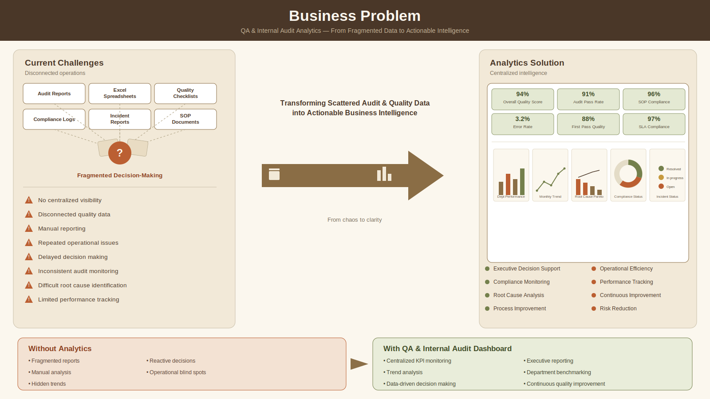
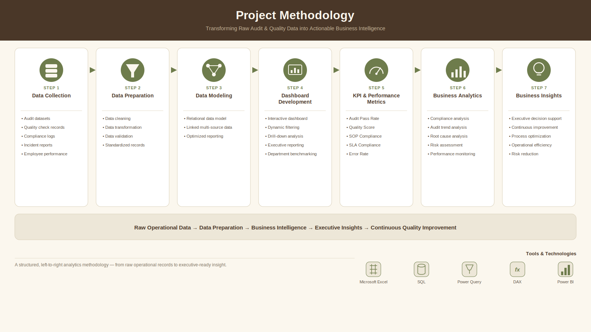

# Quality-Assurance-Internal-Audit-Analytics-Dashboard

# Data-Driven Quality Assurance, Audit Performance & Compliance Analytics

------------------------------------------------------------------------

## Executive Summary

Organizations require **data-driven Quality Assurance and Internal Audit
frameworks** to monitor audit performance, improve compliance, identify
operational risks, and enhance decision-making. This project delivers an
**end-to-end Quality Assurance & Internal Audit Analytics Dashboard**
developed from audit data, providing actionable insights through
interactive KPI monitoring and visual analytics.

By leveraging **audit performance analysis, compliance monitoring, issue
tracking, and risk assessment**, the dashboard enables stakeholders to
evaluate audit effectiveness, identify recurring quality issues,
prioritize corrective actions, and support continuous improvement
initiatives.

### Key Highlights

-   Performed **Quality Assurance and Internal Audit analytics**
-   Delivered **interactive KPI monitoring** for audit performance
-   Enabled **compliance tracking and operational risk analysis**
-   Identified **high-risk audit areas and recurring quality issues**
-   Supported **data-driven decision making** through executive
    dashboards

------------------------------------------------------------------------

## Business Problem

Organizations conduct numerous quality audits and internal assessments,
yet many struggle to convert audit findings into **actionable business
intelligence**. Without centralized analytics, management faces
challenges in monitoring compliance, identifying recurring issues,
prioritizing corrective actions, and improving operational performance.

  

### Key Business Questions

-   Which audit areas generate the highest number of findings?
-   Which departments have the highest compliance scores?
-   What are the most common audit observations?
-   Which risk categories require immediate attention?
-   How effective are corrective actions over time?
-   How can management improve audit efficiency and quality performance?

### Objective

To design a **scalable Quality Assurance & Internal Audit Analytics
solution** that transforms audit records into **interactive business
intelligence**, enabling leadership to monitor KPIs, improve compliance,
reduce operational risks, and support continuous improvement.

------------------------------------------------------------------------

## Methodology

  

-   Collected and transformed audit datasets using structured data
    preparation techniques.
-   Performed data cleaning, validation, and quality checks.
-   Developed an interactive analytics dashboard with dynamic filtering.
-   Created KPI calculations and performance metrics.
-   Conducted compliance analysis, audit trend analysis, and risk
    assessment.
-   Delivered business insights for continuous quality improvement.

------------------------------------------------------------------------

## Skills

**Data Analytics:** Data Cleaning, Data Validation, KPI Analysis,
Business Intelligence

**Dashboard Development:** Interactive Dashboards, KPI Reporting,
Executive Reporting, Data Visualization

**Quality Assurance:** Internal Audit Analytics, Compliance Monitoring,
Risk Assessment, Root Cause Analysis, Corrective Action Tracking

**Business Analytics:** Trend Analysis, Performance Monitoring,
Operational Analytics, Decision Support

------------------------------------------------------------------------

## Results & Business Recommendations

The **Quality Assurance & Internal Audit Analytics Dashboard** consolidates audit records, quality checks, compliance data, and incident reports into a centralized Business Intelligence solution. It enables stakeholders to monitor operational performance, evaluate compliance, identify recurring quality issues, and support data-driven decision-making through interactive dashboards and KPI reporting.

### Project at a Glance

| Metric | Value |
|--------|------:|
| Employees Analyzed | **500** |
| Internal Audits Conducted | **1,200** |
| Quality Checks Evaluated | **7,000** |
| Incidents Monitored | **800** |
| Overall Quality Score | **95.2%** |
| Audit Pass Rate | **96.1%** |
| Audit Completion Rate | **100%** |
| SOP Compliance | **98.3%** |
| First Pass Quality (FPQ) | **94.8%** |
| Documentation Accuracy | **97.6%** |
| SLA Compliance | **96.9%** |
| Error Rate | **4.8%** |
| Average Resolution Time | **2.3 Days** |

---

### Executive Performance Overview

Provides a centralized view of quality performance through executive KPIs, operational trends, compliance monitoring, and audit performance, enabling leadership to evaluate organizational health from a single dashboard.

---

### Internal Audit Analytics

Monitors audit completion, audit pass rates, audit scores, department-wise audit performance, audit type distribution, and auditor effectiveness to improve governance and accountability.

---

### Quality Assurance & Compliance Monitoring

Tracks Overall Quality Score, SOP Compliance, First Pass Quality, SLA Compliance, Documentation Accuracy, and Error Rate to support continuous quality improvement and operational excellence.

---

### Root Cause & Risk Analysis

Analyzes recurring errors, severity levels, Pareto trends, and corrective actions to identify high-risk operational areas and prioritize process improvements.

---

### Employee Performance Analytics

Evaluates employee and departmental performance using quality metrics, audit outcomes, productivity indicators, and compliance scores to support performance management and targeted improvement initiatives.

---

## Key Business Insights

- Centralized KPI monitoring provides complete visibility into audit performance, quality assurance, and compliance across the organization.
- Analysis of **1,200 audits**, **7,000 quality checks**, and **800 operational incidents** enables comprehensive performance evaluation and risk monitoring.
- A **95.2% Overall Quality Score** and **96.1% Audit Pass Rate** demonstrate strong organizational quality performance.
- **98.3% SOP Compliance** and **96.9% SLA Compliance** indicate consistent adherence to operational standards and service commitments.
- Root Cause Analysis identifies recurring operational issues, enabling proactive corrective and preventive actions.
- Department benchmarking and employee performance analytics support targeted coaching, accountability, and continuous process improvement.
- Interactive dashboards enable executives to make faster, data-driven decisions through centralized reporting and real-time performance monitoring.

---

## Strategic Recommendations

- Prioritize corrective actions for departments with consistently low audit and quality scores.
- Strengthen compliance monitoring through continuous KPI tracking and SOP adherence reviews.
- Conduct periodic Root Cause Analysis to reduce recurring operational issues.
- Standardize audit documentation and quality review processes across departments.
- Expand KPI monitoring to improve operational transparency and executive reporting.
- Utilize historical trends to support predictive risk assessment and continuous quality improvement.
